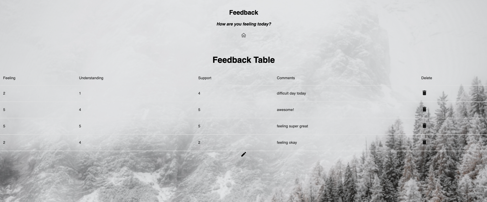

# Redux-Feedback-Loop

## Description

This project creates a feedback loop of: Feeling, Understanding, Supported and Comments. Users can submit there feedback and with show up on the feedback table. 

This project uses: React.js, React-Redux, Express.js and postGresSQL. 

# SQL - TO - DO - LIST

